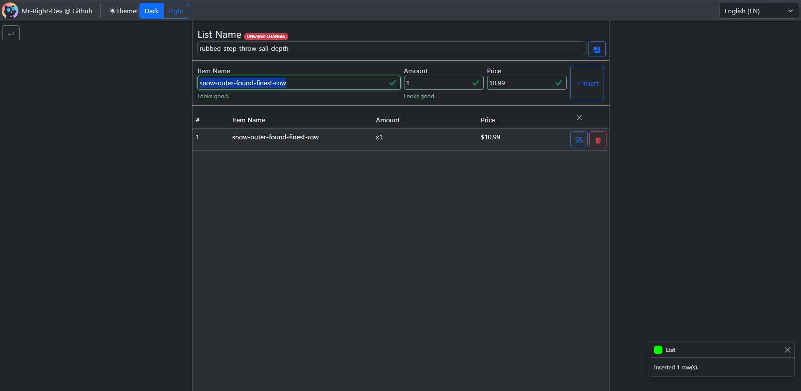
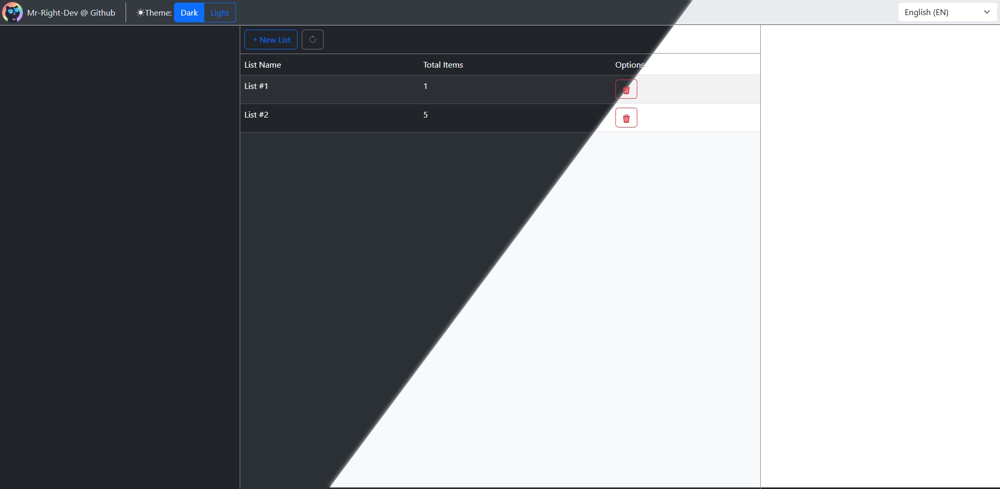
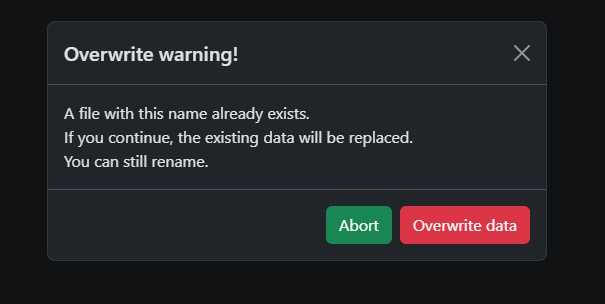
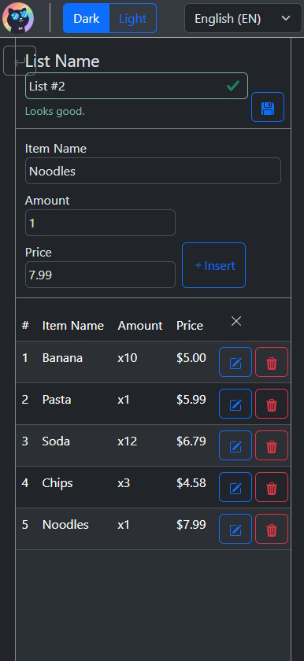

> [!NOTE]
> This is one of my attempts to use vite, more features might be added.

# About
The project its a simple list making app, it stores your lists with names,
ammounts and prices.


# Features
* Dark/Light theme. <br>
  
* Multi-language support. (EN_US/PT_BR) 
* Anti-duplicated titles. since we "use" the title as a sort of a id, <br> data can be overwritten. But there is a system in place to stop that. 
  
* Mobile support. <br>
  

# How to build it
> [!IMPORTANT]
> It's recomended to use node 25.
* Run theese commands to build the app:
```bash
npm install
npm run build
```
* To build it for android:
```bash
npx cap init
npx cap add android
npx cap sync android
npx capacitor-assets generate --android 
npx cap open android
```

# What was used
* Vite + React + TS
* Bootstrap
* Capacitor (for mobile support)
* Dexie (local database)
* i18next (for multi-lang)

# Features I intent to add:
- [ ] See the total.